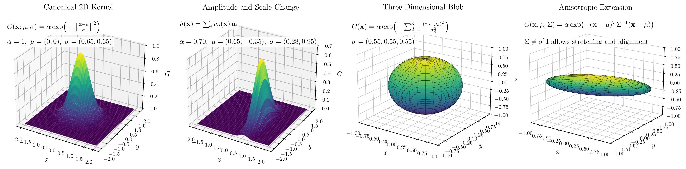

# gaussian-flow-codecs

`gaussian-flow-codecs` is the public code repository for the Gaussian flow compression work. The goal of this repo is to provide a clean, installable, and extensible implementation of compact Gaussian parametric representations for fluid flow fields.

Author: Dhanush Vittal Shenoy

Associated paper: Gaussian Field Representations for Turbulent Flow: Compression and Physical Fidelity Analysis

This repository is being migrated from the paper workspace into a clean public package. The first public release focuses on the Gaussian compression workflow itself: baseline Gaussian fitting together with the adaptive placement and anisotropic extensions that support the main method.

## Planned Scope

- Gaussian snapshot compression and reconstruction
- Adaptive and structure-aware Gaussian variants
- Command-line workflows for fitting, reconstructing, and exporting results
- A stable codebase that others can inspect and extend

## Gaussian Primitive Intuition

The repository is built around localized Gaussian primitives. Each primitive has:

- a center in space
- a support width or covariance
- a vector amplitude

The figure below gives the geometric intuition behind the main representation choices used in the codebase.



From left to right, the figure shows:

- a canonical two-dimensional Gaussian kernel
- a shifted and rescaled kernel with different amplitude and support
- an isotropic three-dimensional Gaussian blob
- an anisotropic three-dimensional Gaussian blob with directional stretching

This is the main reason the repository is organized by methods such as `baseline`, `adaptive`, `anisotropic`, `multires`, and `beta`: each method changes how these primitives are placed or shaped.

## Repository Layout

```text
gaussian-flow-codecs/
├── pyproject.toml
├── README.md
├── LICENSE
├── docs/
│   └── images/
└── src/
    └── gaussian_flow_codecs/
        ├── adaptive/
        ├── methods/
        ├── metrics/
        ├── models/
        ├── training/
        ├── visualization/
        ├── vtk_io/
        ├── __init__.py
        └── cli.py
```

## Installation

```bash
pip install -e .
```

## Command Line Interface

After installation, the package exposes a method-first CLI:

```bash
gfc --help
```

The main workflows are:

```bash
gfc fit baseline --help
gfc fit adaptive --help
gfc fit anisotropic --help
gfc fit multires --help
gfc fit beta --help
```

Each command maps directly to one of the Gaussian representations discussed in the paper, so users do not have to decode a large monolithic training script just to understand what changes between methods.

Typical usage only requires:

- the input VTK snapshot
- the output directory
- the kernel budget
- a training preset (`fast`, `default`, or `hq`)

For example:

```bash
gfc fit baseline --vtk-file path/to/example.vtk --results-root results/baseline --n-gaussians 4096
gfc fit anisotropic --vtk-file path/to/example.vtk --results-root results/anisotropic --n-gaussians 4096 --preset hq
```

## Methods

| Method | What changes |
| --- | --- |
| `baseline` | Diagonal Gaussian kernels on a regular grid |
| `adaptive` | Redistributes kernels toward difficult regions |
| `anisotropic` | Uses full covariance kernels for stretched structures |
| `multires` | Uses coarse and fine kernel supports |
| `beta` | Replaces the Gaussian kernel with a compact-support beta basis |

## Development Plan

1. Stabilize the Gaussian snapshot workflow.
2. Add baseline and structure-aware benchmark commands.
3. Add example datasets and end-to-end command examples.
4. Add tests, documentation, and contribution guidelines.

## License

This repository is released under the MIT License.

## Citation

If you use this repository in academic work, please cite the associated paper once the final bibliographic information is available.
